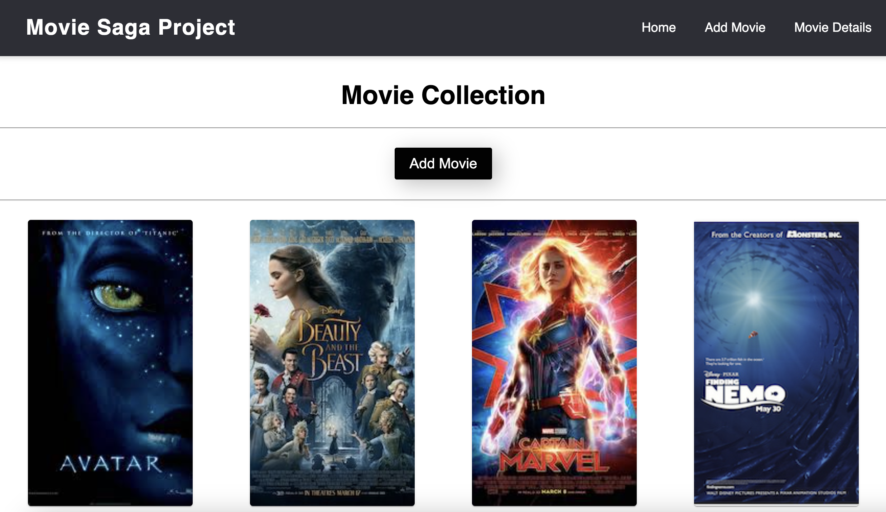

# Saga Movie Gallery

## Description

This project was an expansion on a movie management application. The movies already existed in the database but they needed to be styled and needed additional functionality. The user will be able to see a detailed view for each individual movie, including all genres associated with that movie, once the movie posted is clicked on.

## Install Dependencies

1. `npm install`
2. `npm run server`
3. `npm run client`

## Database Setup

1. Create a database named `saga_movies_weekend`
2. Run the queries from `database.sql` on the `saga_movies_weekend` database

### Home / List Page

This view displays all of the movies in the movie database.

- The home page has a `Add Movie` button, which will bring the user to the `/addMovie` view which includes a "Add Movie" form.
- The home page also includes functinality so when a movie poster is clicked, a user should be brought to the `/details` view for that movie.
- There is also a `Delete` button that removes the movie from the home page and the database.

### Details Page

This page shows all the details **including ALL genres** for the selected movie, including title, description, and the image, too!

- Sagas and redux were used for the data management.
- Edit details button brings the user to a edit page with all of the information pre-filled out so its easy to make edits.
- From there the user can either save or cancel the edit and it will return them back to the details view.
- The details page has a `Back to List` button, which will bring the user to the Home/List Page.
- The details view remains when the refresh button is clicked.

### Add Movie Form Page

This page shows an input for to add a movie to the Movie list

- This form includes an input for a Movie Title, Poster Image Url, Description, and a dropdown selector for the Genre.
- The add movie page has a `cancel` button, which will clear the inputs and bring the user back to the Home/List Page.
- The add movie page has a `save` button, which will save the input information in the database and clear the input fields. It will also bring the user back to the Home/List Page and display the newly added movie.

## PHOTOS OF THE PROJECT

1. 
2. 
3. 
4. 
5. 

### Built With

- HTML
- CSS
- Axios
- Javascript
- React.js
- Redux
- Sagas
- Material UI
- PG
- Express.js
- PostgresSQL
- Postico
- Postman
- Git
- GitHub
- VScode
- Nodemon (for development)
- Sweet Alerts

### Acknowledgement

Thanks to [Emerging Digital Academy](http://www.emergingacademy.org) who equipped and helped me to make this application a reality.

### Support

If you have suggestions or issues, please email me at [alyssa.s.nichols94@gmail.com](mailto:alyssa.s.nichols94@gmail.com)
